# Bakery Sales and Inventory System Diagram Package

This document is the generated visual documentation package for the Bakery Sales and Inventory System. It uses the project documentation, Django models, URL routes, services, and database schema as the factual basis for the diagrams.

## Unified Visual Legend

| Element Type | Color | Meaning |
|---|---:|---|
| External users / actors | Orange | Human roles and outside users |
| Processes / modules | Blue | Application workflows and system services |
| Data stores / databases | Green | Persistent tables, files, and reports |
| Decisions | Yellow | Branching rules and validations |
| Relationships / connectors | Gray | Data movement, control flow, and dependencies |

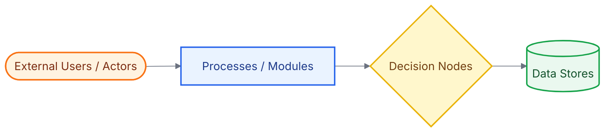

## Extracted System Elements

| Category | Extracted Items |
|---|---|
| User roles | Admin, Cashier, Inventory Staff, Customer |
| Main modules | Authentication, Dashboard, POS/Sales, Inventory, Catalog, Orders, Reports, Audit Logs, Employee Management, Backup |
| Core entities | User, Group, EmployeeSecurity, Category, Supplier, Product, ProductionBatch, BatchAllocation, Order, Sale, SaleItem, VoidedSaleItem, InventoryLog, ActivityLog, LoginHistory, Note |
| Main workflows | Login, forced password change, product/category/supplier management, stock restock/adjustment, FIFO sales, sale void, custom order tracking, report export, audit review |
| Outputs | Receipts, PDF receipts, sales CSV/XLSX/PDF reports, dashboard metrics, inventory movement logs, activity logs, login history, SQLite backup in local development |
| Key business rules | Role-based access, positive quantities, non-negative money/stock, pickup date not before order date, FIFO batch allocation, void reason required, admin-only void, append-only logs, archived products unavailable for orders/sales, last active admin protected |

## 1. Conceptual Framework

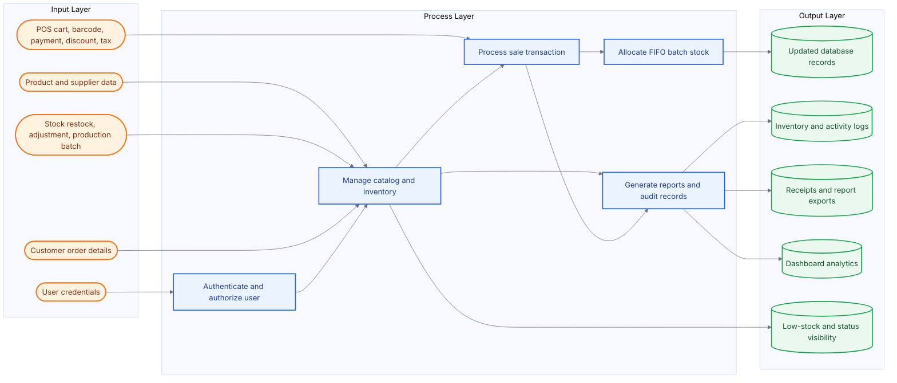

## 2. System Flowchart

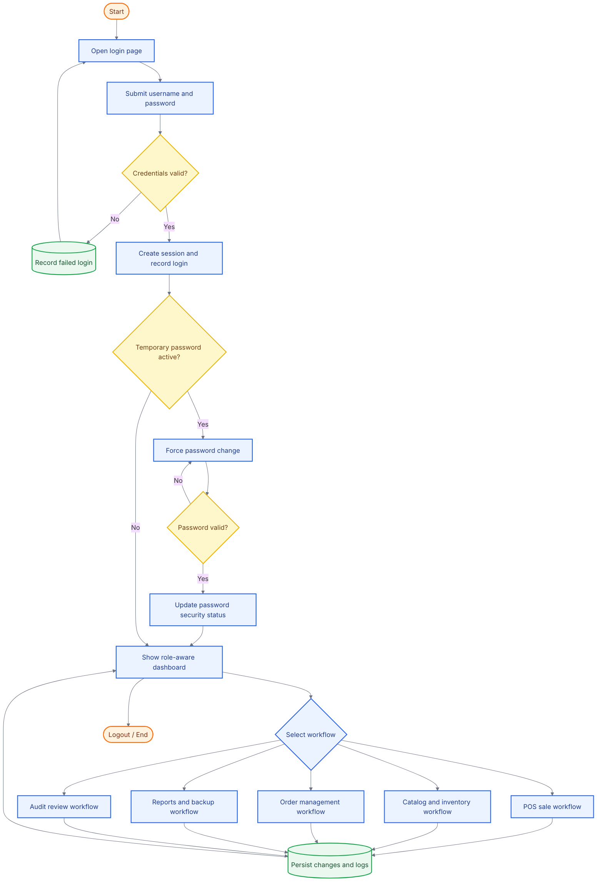

## 3. Data Flow Diagram Level 0

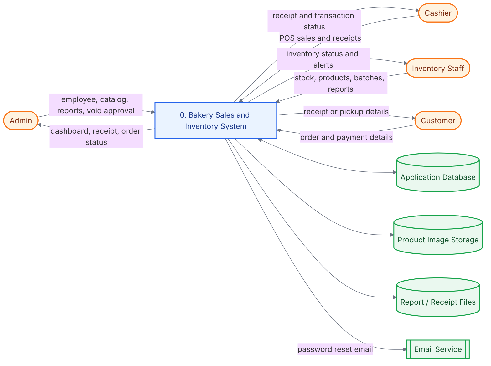

## 4. Data Flow Diagram Level 1

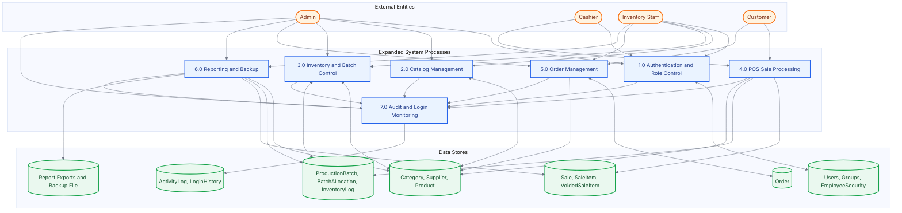

## 5. Use Case Diagram

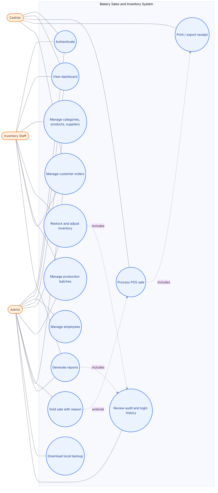

## 6. Activity Diagram

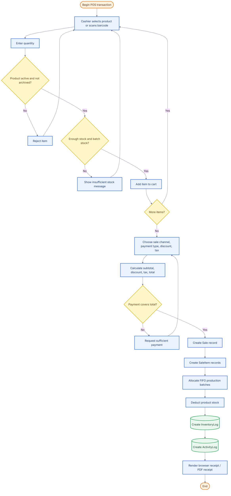

## 7. Sequence Diagram

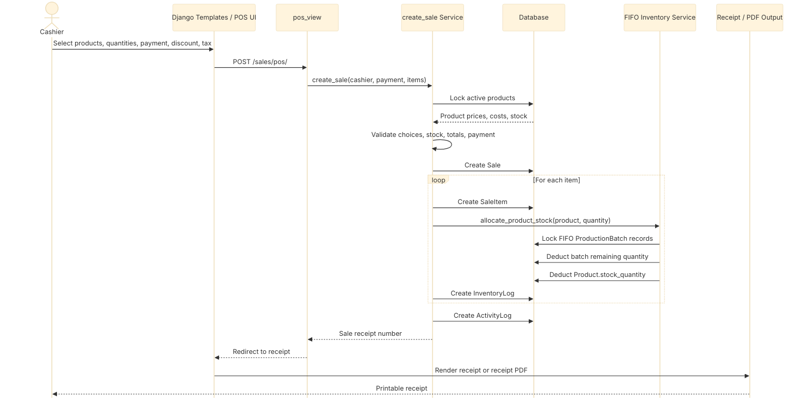

## 8. System Architecture Design

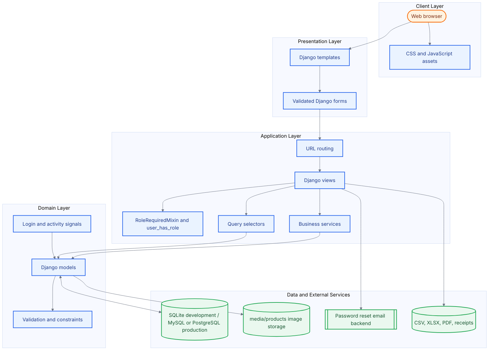

## 9. Entity Relationship Diagram

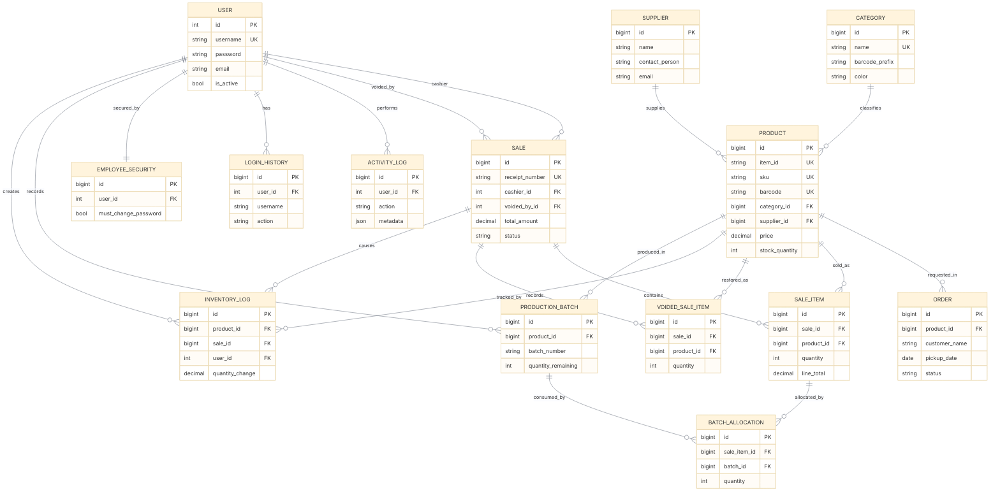

## 10. Database Schema Diagram

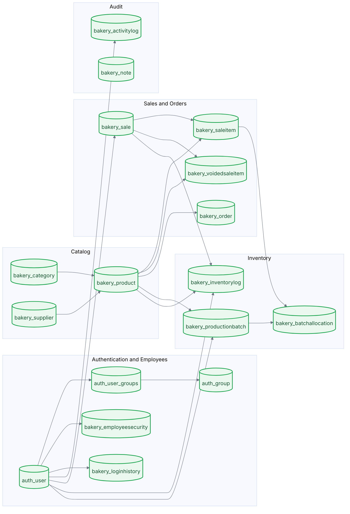

## 11. Data Dictionary

| Entity | Field Name | Data Type | Description | Constraints | Relationships |
|---|---|---|---|---|---|
| User | id | int | Employee account identifier | PK, auto increment | Referenced by Sale, ActivityLog, InventoryLog, LoginHistory, EmployeeSecurity |
| User | username | varchar(150) | Login username | Unique, required | Used by authentication |
| User | password | varchar(128) | Hashed password | Required | Managed by Django auth |
| User | email | varchar(254) | Account email | Optional in schema | Used by password reset |
| User | is_active | boolean | Account availability | Required | Archived employees set false |
| User | is_superuser / is_staff | boolean | Administrative flags | Required | Enables owner/admin behavior |
| Group | id | int | Role identifier | PK | Connected through auth_user_groups |
| Group | name | varchar(150) | Role name | Unique | Admin, Cashier, Inventory Staff |
| EmployeeSecurity | id | bigint | Security record identifier | PK | One-to-one with User |
| EmployeeSecurity | user_id | int | Secured employee | FK, unique | User.id |
| EmployeeSecurity | must_change_password | boolean | Forces password change after temporary password | Required | Checked after login |
| EmployeeSecurity | temporary_password_created_at | datetime | Temporary password timestamp | Nullable | Set by admin password reset |
| Category | id | bigint | Category identifier | PK | Referenced by Product |
| Category | name | varchar(100) | Category name | Unique, required | Product.category_id |
| Category | barcode_prefix | varchar(12) | SKU/barcode prefix | Auto-filled when blank | Used for product code generation |
| Category | color | varchar(20) | Category display color | Default color | Product theme fallback |
| Supplier | id | bigint | Supplier identifier | PK | Referenced by Product |
| Supplier | name | varchar(150) | Supplier name | Required | Product.supplier_id |
| Supplier | contact_person / phone / email / address | text/varchar | Supplier contact details | Optional | Display and product metadata |
| Product | id | bigint | Product identifier | PK | Referenced by orders, sales, inventory |
| Product | item_id | varchar(30) | Internal item code | Unique, nullable | Auto-generated if blank |
| Product | sku | varchar(50) | Stock keeping unit | Unique, required | Searchable product code |
| Product | barcode | varchar(80) | Barcode value | Unique, nullable | POS barcode lookup |
| Product | name | varchar(150) | Product name | Required | Displayed across modules |
| Product | category_id | bigint | Product category | FK, protected | Category.id |
| Product | supplier_id | bigint | Optional supplier | FK, nullable | Supplier.id |
| Product | price / cost | decimal(10,2) | Selling price and unit cost | Non-negative | Used for totals and profit |
| Product | stock_quantity | positive int | Available stock | Non-negative | Updated by sales, restocks, voids |
| Product | low_stock_threshold | positive int | Low-stock trigger | Non-negative | Dashboard and inventory alerts |
| Product | production_date / expiry_date | date | Product dating metadata | Expiry cannot precede production | Status display |
| Product | is_active / is_archived / is_deleted | boolean | Availability flags | Archived products inactive | Controls sales and orders |
| Product | archived_by_id / archived_at | int/datetime | Archive audit metadata | Nullable FK | User.id |
| ProductionBatch | id | bigint | Batch identifier | PK | Referenced by BatchAllocation |
| ProductionBatch | product_id | bigint | Product produced | FK, required | Product.id |
| ProductionBatch | batch_number | varchar(50) | Batch code | Unique per product | FIFO allocation |
| ProductionBatch | production_date / expiry_date | date | Batch dates | Expiry cannot precede production | FIFO order |
| ProductionBatch | quantity_produced | positive int | Produced amount | >= 1 | Batch capacity |
| ProductionBatch | quantity_remaining | positive int | Remaining amount | >= 0 and <= produced | Deducted by sale allocations |
| ProductionBatch | recorded_by_id | int | User who recorded batch | Nullable FK | User.id |
| BatchAllocation | id | bigint | Allocation identifier | PK | Connects sale items to batches |
| BatchAllocation | sale_item_id | bigint | Sold line item | FK, required | SaleItem.id |
| BatchAllocation | batch_id | bigint | Consumed batch | FK, protected | ProductionBatch.id |
| BatchAllocation | quantity | positive int | Allocated quantity | >= 1 | Restored during void |
| BatchAllocation | restored_at | datetime | Void restoration timestamp | Nullable | Prevents duplicate restoration |
| Sale | id | bigint | Sale identifier | PK | Referenced by SaleItem, VoidedSaleItem, InventoryLog |
| Sale | receipt_number | varchar(30) | Official receipt number | Unique, required | Generated by service |
| Sale | cashier_id | int | Cashier who completed sale | FK, protected | User.id |
| Sale | sale_channel | varchar(20) | walk_in or online | Choice constraint | POS input |
| Sale | payment_type | varchar(20) | cash, gcash, maya, card | Choice constraint | POS input |
| Sale | subtotal / discount_amount / tax_amount / total_amount | decimal(12,2) | Financial totals | Non-negative | Report and receipt totals |
| Sale | tax_rate | decimal(5,4) | Tax rate | 0 to 1 | Used in total calculation |
| Sale | payment_amount / change_amount | decimal(12,2) | Payment and change | Non-negative | Payment must cover total |
| Sale | status | varchar(20) | completed or voided | Choice constraint | Void workflow |
| Sale | voided_by_id / voided_at / void_reason | int/datetime/text | Void approval details | Nullable except reason during void | User.id |
| SaleItem | id | bigint | Sale line identifier | PK | Referenced by BatchAllocation |
| SaleItem | sale_id | bigint | Parent sale | FK cascade | Sale.id |
| SaleItem | product_id | bigint | Sold product | FK protected | Product.id |
| SaleItem | quantity | positive int | Quantity sold | >= 1 | Deducts stock |
| SaleItem | unit_price / unit_cost / line_total | decimal | Sale line pricing | Non-negative | Profit and receipts |
| VoidedSaleItem | id | bigint | Voided line identifier | PK | Created when sale is voided |
| VoidedSaleItem | sale_id / product_id | bigint | Voided transaction and product | FKs | Sale.id, Product.id |
| VoidedSaleItem | quantity / unit_price / line_total | int/decimal | Restored item details | Positive or non-negative | Stock restoration evidence |
| VoidedSaleItem | reason | varchar(255) | Void reason | Required | Admin approval record |
| Order | id | bigint | Customer order identifier | PK | Optional Product reference |
| Order | customer_name / contact | varchar | Customer details | Required | Order fulfillment |
| Order | product_id | bigint | Requested product | Nullable FK | Product.id |
| Order | order_date / pickup_date | date | Order and pickup dates | pickup_date >= order_date | Scheduling rule |
| Order | quantity | positive int | Ordered quantity | >= 1 | Estimated total |
| Order | estimated_total | decimal(12,2) | Estimated order value | Non-negative | Order display |
| Order | status | varchar(20) | pending, in_progress, completed, claimed, cancelled | Controlled transitions | Workflow state |
| InventoryLog | id | bigint | Inventory history identifier | PK, append-only | Product and sale movements |
| InventoryLog | item_type | varchar(20) | Inventory item type | product only | Future extension point |
| InventoryLog | action | varchar(20) | restock, sale, adjustment, void | Choice constraint | Movement classification |
| InventoryLog | reason | varchar(30) | restock, damaged, expired, returned, sampling, staff_consumption | Choice/blank | Deduction explanation |
| InventoryLog | product_id / sale_id / user_id | bigint/int | Movement references | Nullable FKs | Product.id, Sale.id, User.id |
| InventoryLog | quantity_before / quantity_change / quantity_after | decimal(12,2) | Stock movement amounts | Required | Audit trail |
| ActivityLog | id | bigint | Activity identifier | PK, append-only | User activity audit |
| ActivityLog | user_id | int | Acting user | Nullable FK | User.id |
| ActivityLog | action | varchar(20) | login, logout, create, update, delete, archive, stock, sale, void, backup, restore, password | Choice constraint | Audit classification |
| ActivityLog | model_name / object_id / object_repr | varchar/text | Affected object metadata | Optional | Generic audit reference |
| ActivityLog | ip_address / metadata | IP/json | Request and structured details | Nullable/default JSON | Security review |
| LoginHistory | id | bigint | Login event identifier | PK, append-only | Authentication audit |
| LoginHistory | user_id | int | Related account | Nullable FK | User.id |
| LoginHistory | username | varchar(150) | Attempted username | Optional | Failed login tracking |
| LoginHistory | action | varchar(20) | login, logout, failed | Choice constraint | Auth event status |
| LoginHistory | ip_address / user_agent | IP/varchar | Client request details | Optional | Monitoring |
| Note | id | bigint | Note identifier | PK | Standalone dashboard/content note |
| Note | title / content | varchar/text | Note content | Required | Informational |
| Note | is_active | boolean | Note visibility | Required | Active note filtering |

## 12. Relationship Mapping Diagram

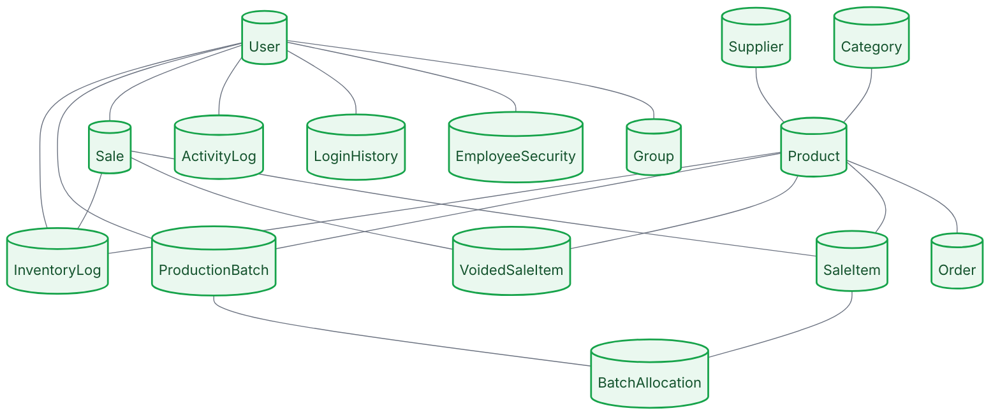

## Workflow and API Route Summary

| Module | Main Routes | Primary Inputs | Primary Outputs |
|---|---|---|---|
| Authentication | `/login/`, `/logout/`, `/password-reset/`, `/password-change-required/` | credentials, reset email, new password | session, login history, password activity log |
| Employee management | `/employees/`, `/employees/add/`, `/employees/<id>/edit/`, `/employees/<id>/password/` | account details, role, temporary password request | user record, employee security record, activity log |
| Catalog | `/categories/`, `/products/`, `/suppliers/` | category, product, supplier data | catalog records, product image references, activity log |
| Inventory | `/inventory/`, `/products/<id>/restock/`, `/production/` | stock changes, production batch details | updated stock, production batches, inventory logs |
| Sales | `/sales/pos/`, `/sales/`, `/sales/<id>/receipt/`, `/sales/<id>/void/`, `/sales/<id>/receipt.pdf` | cart items, payment, sale channel, discount, tax, void reason | sale, sale items, stock deduction/restoration, receipts |
| Orders | `/orders/`, `/orders/add/`, `/orders/<id>/edit/` | customer, contact, product, quantity, pickup date | tracked order status |
| Reports and backup | `/reports/`, `/reports/sales.csv`, `/reports/sales.xlsx`, `/reports/sales.pdf`, `/backup/database/` | report request, backup request | exports, local SQLite backup, activity log |
| Audit | `/audit/activity/`, `/audit/logins/` | filters/search from UI | activity history, login history |

